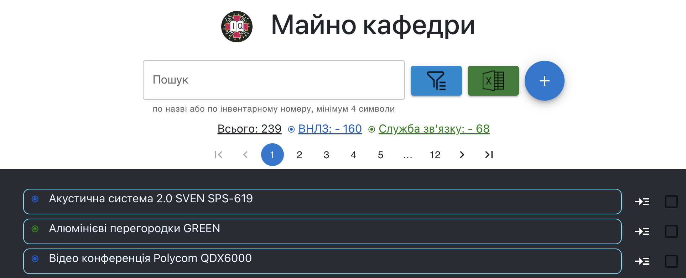

# ItemsManager

Item managing web-application for internal use. Quick search, filter and export items, writing notes, adding useful
details about items and tangibles.



## Main features

This app was build as an internal use tool to manage items - quickly find them make essential notes for them, sort and
filter according to most common requests in my department - like find me all items that are older than 2014 year.

The search works by name or by inventory number

Every authorized person can search , filter and export the list, add new field (property) to the existing item, or
create new items, but only root user can add new users or delete items.

Unathorized users can not see any items.

## Decisions

Mongo DB was chosen since there are no relations between instances here , and mostly those instances may have different
properties , because they go from different Service Department where they used to store them in xls tables and those
tables have different titles.

## Deploy and run

1. Git clone this repo:

```git clone https://github.com/dmytro-ustynov/ItemsManager.git```

2. Create `.env` file from `.env.example` template:

```cp .env.example .env```

3. Fill empty lines in .env file -- credentials for DB and secret strings. You may create strong secret string or
   password with the command:

```
openssl rand -base64 12 
# This will output smth like: WvWG/9DFiENuJStn 
```

4. Fill the `config.yaml` with services you want to have in your app. You may add new services, or delete existing ones.
   Adjust colors, for better representation in a list, use css names for colors, or hex numbers like:

    * <span style="color:wheat;"> ⦿ "wheat"</span>
    * <span style="color:green;"> ⦿  "green"</span>
    * <span style="color:#0a58ca;"> ⦿ "#0a58ca"</span>
    * <span style="color:#90afea;"> ⦿ "#90afea"</span>

  <details>
  <summary>What the 'config.yaml' file is and what its' sections responsible for?</summary>
  
#### Section services

This section describes how list of the items will look like. It specifies services that you have in your organization. You may add new services or delete(rename) existing in the config.yaml file. The services are used to categorize items in the list. The color of the service is used to represent the service in the list. You may use css color names or hex numbers.


#### Section categories

This section describes how filters will look like. It specifies categories that you may use to filter items in the list. You may add new categories or delete(rename) existing in the config.yaml file. If you want filters work properly, the items in DB should have 'category' attribute. The value of the 'category' should be the same as keys in the 'categories' section of the config.yaml file. While the values will be the titles of the checkboxes.


</details>

6. Run the command:

`python generate_static.py`

This will add necessary files to the client part of the app - 'generated.css' and 'generated_constants.js' files

6. Build and run containers with the command:

`docker-compose up -d --build`

Wait for a while until containers are being built and started.
After proces was finished you should see:

```
Creating items-db ... done
Creating items-server ... done
Creating items-client ... done
```

5. Ready to go! Visit http://localhost and you will see running application. But it has an empty list yet.


6. Load items to DB. You may upload the collection to MongoDB Manually, or create admin user and load them from xls
   file.

To upload manually - connect to your Database with the 3rd party tool like MongoDB Compass or Robo 3T with credentials
you have specified in `.env` file and insert items to the collection "ITEMS".

7. Create root user. Go to http://localhost:5000/docs#/user/user_signup_user_signup_post.

- Create user using this endpoint, Press try it put and write username "root" and password as json. Not well secured, I
  know, but you need it only once. And it fits well for internal use. And for every other admin user you will utilize
  operating this app. Remember the root password, you will need it to approve other users.

```json
{
  "username": "root",
  "password": "your_password_here"
}
 ``` 


8. Prepare xls table with items you want to add.
   Required fields are only :

- Найменування
- Інвентарний номер
- Служба

Create `xls` file that will have such columns with these names, the first row on the sheet will be considered as
property names, and starting from the row 2 all lines will be considered as items. Every line is the item to create and
insert to DB with property that is written in the corresponding column. Empty cells are allowed except column **"
Найменування"**. Once the empty first cell in a row was found - this will be considered as the end of the table.

The values in column `"Служба"` should be the same as you specified in the `config.yaml` file. This is required for good
representation of the item list.

Any other fields (columns) you may add on your demands.

9. Use bulk upload to add all your items from xls to DB.
   
